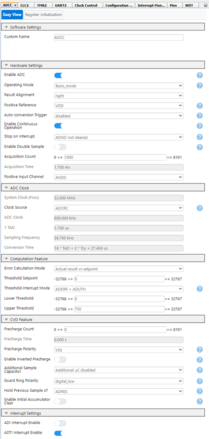
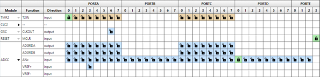
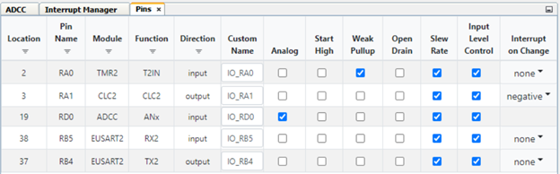

<!-- Please do not change this logo with link -->

[](https://www.microchip.com)

# Intro to Sleep with MCC Using a PIC16F18076

<!-- This is where the introduction to the example goes, including mentioning the peripherals used -->
Low power modes are essential for any embedded designer looking to minimize their design’s power consumption. This example will cover how to use the low power “Sleep Mode” on the PIC16F18076 and similar microcontrollers. Alongside sleep mode we will also be using the Watchdog Timer, Interrupt on Change (IoC) and the ADCC and EUSART peripherals. 

## Related Documentation

-	[PIC16F18076 Family Product Page](LINK!!!)

## Software Used

- MPLAB® X IDE 6.1.0 or newer [(MPLAB® X IDE 6.1)](https://www.microchip.com/en-us/development-tools-tools-and-software/mplab-x-ide?utm_source=GitHub&utm_medium=TextLink&utm_campaign=MCU8_MMTCha_MPAE_Examples&utm_content=pic16f18076-intro-to-sleep-mplab-mcc-github)
- MPLAB® XC8 2.41.0 or newer compiler [(MPLAB® XC8 2.41)](https://www.microchip.com/en-us/development-tools-tools-and-software/mplab-xc-compilers?utm_source=GitHub&utm_medium=TextLink&utm_campaign=MCU8_MMTCha_MPAE_Examples&utm_content=pic16f18076-intro-to-sleep-mplab-mcc-github)
- MPLAB® Code Configurator (MCC) 5.3.7 or newer [(microchip.com/mplab/mplab-code-configurator)](https://www.microchip.com/mplab/mplab-code-configurator)
- Microchip PIC16F1xxxx_DFP Series Device Support (1.18.352) or newer [(packs.download.microchip.com/)](https://packs.download.microchip.com/)


## Hardware Used

-	PIC16F18076 Curiosity Nano [Prod ID!!!](Link!!!) 
-	Curiosity Nano Base for Click boards™ [(AC164162)](Link!!!)
-	Mic Click board™ [(MIKROE-2563)](https://www.mikroe.com/mic-click) or other Click board with analog output

## Setup

<!-- Explain how to connect hardware and set up software. Depending on complexity, step-by-step instructions and/or tables and/or images can be used -->
### Hardware Setup
Plug the PIC16F18076 into the Curiosity Nano Base board and the MikroE Mic Click into mikroBUS 1.

### Initial Setup for all examples

First, we’ll have to start a new project and enter MCC.


Enter “Configuration Bits” and set the “External Oscillator Selection bits” to “Oscillator not Enabled” and “Reset Oscillator Selection bits to “HFINTOSC(1MHz)” (or 32MHz). And to optimize low power performance for the purposes of this demo, disable "Brown Out Reset".


Next, go in “Clock Control” under “Project Resources” and select “HFINTOSC_32MHz” for “Current Oscillator Select” and “32_MHz” for “HF Internal Clock”.


Lastly, for testing and debugging, add the UART module on “Device Resources” and select the EUSART2 PLIB. Enable “Redirect Printf to UART” and set the baud rate to 115200. 

When moving from MCC configuration to application code, much of the process of entering “sleep” remains the same. The user calls the command SLEEP() or __asm(“sleep”) and the microcontroller will enter it’s low power state. The tricky aspect then becomes leaving Sleep mode, as the CPU is no longer running at this point. As a rule of thumb, any interrupt or reset that can be triggered while in this state can be used to wake up the device .

### Using Resets with Sleep Mode

Now the initial setup has been handled, the first method we’ll be covering is waking up the microcontroller from sleep using the watchdog timer (WDT). The WDT is traditionally used as a reset to protect from infinite loops or freezes, however the WDT can be configured to run while the device is in sleep, and when a timeout event occurs the MCU will leave its sleep mode instead of executing a reset. This can be achieved by enabling the Watchdog timer before sending the sleep command and simply waiting for it to time out.


To start, return to the “Configuration Bits” menu and set “WDT Operating Mode bits” to “WDT enabled/disabled by SEN bit” (the SEN bit is useful for disabling the WDT when not in use).


Following setting the WDT in your configuration bits, go to {WDT directory here!!!} and set “Software Controlled Watchdog Timer Enable” to “ON”, set the Watchdog Timer to either the LFINTOSC or Secondary Oscillator (SOSC) and set the prescaler to a reasonable value. This example uses 1:65536 with the LFINTOSC for a timer of approximately 2 seconds, however a different timer period may be used.
After your code is generated just enable the watchdog timer with the SEN bit before calling the sleep command and disable it after leaving sleep to prevent accidental resets. An example of this is shown below:

```WDTCONbits.SEN = 1; //Enable Watchdog Timer while in sleep
SLEEP();
NOP();
WDTCONbits.SEN = 0; //Disable Watchdog to prevent full reset```

NOTE: It’s good practice to place a NOP command after a sleep command. When the sleep command is called, the next assembly line is cached in the CPU. Having a NOP ensures no accidental operations are executed when switching in or out of low-power modes.

### Using Peripheral Interrupts With Sleep Mode

Our next example for working with the PIC16F18076’s sleep mode is peripheral interrupts. This can be anything from a Timer peripheral, the CLC, ADCC, and more. For this example, we will be using the Threshold Interrupt for the ADCC peripheral, so while the specifics for setting up a peripheral will vary, the general process for using any peripheral interrupt as a wake-up will remain similar.



Before setting up the interrupt, the peripheral will need to be configured. For this example the ADCC will be running in Basic Mode, Right-Aligned, and in !!!Note to self, fix continuous with TMR2!!!Continuous Mode. The Acquisition Count is set to 1000. The ADCC oscillator must be set to ADCRC to enable ADCC operation while the PIC16F18076 is in sleep. For the threshold: set the “Error Calculation Mode” to “Actual Result vs. Setpoint”, the “Threshold Setpoint” to “0”, “Threshold Interrupt Mode” to “ADERR > ADUTH”, and “Upper Threshold” to your desired ADCC reading to trigger a wakeup (this example will use 750). Last for this menu, switch on “ADTI Interrupt Enable”. 



Next, navigate to the “Pin Grid View” at the bottom of the screen and set the ADCC ANx function to your desired analog pin (RD0 in this example). 



Then, open the “Pins” menu under “Project Resources” and check that RD0 is set to “Analog”.

After configuring your peripheral and enabling interrupts for it it’s time for application code. Generate your MCC code and go into the main.c. Enable interrupts by uncommenting “INTERRUPT_GlobalInterruptEnable();” and “INTERRUPT_PeripheralInterruptEnable();”.
Note: Peripheral Interrupts for the PIC16F18076 may be used to wake the device from sleep by only enabling peripheral interrupts, however they will be unable to execute tasks from the ISR in this fashion. Enabling global interrupts allows us to use interrupts for our testbench later in this example.
Lastly include the function call “ADCC_StartConversion(ADPCH);” in the main function, but before the while loop, to start the ADCC and the ADCC peripheral is now set up to wake the device when a certain threshold is triggered.


### Using IoC for Wake-Up
!!!
### Setting up a Test for Each Method

To test for each method a software flag has been created in the main.c file. The ISR is set so that any interrupt will trigger a corresponding bit to flip in the defined value (or in the case of the WDT, the software flag is set as the inverse of the WDT's existing flag). After waking, the device will then read that software flag and output a corresponding message in UART signaling which method woke up the microcontroller.

## Operation

<!-- Explain how to operate the example. Depending on complexity, step-by-step instructions and/or tables and/or images can be used -->
### Data Visualizer Output

After programming, the device will immediately go to sleep after initializing. If the pushbutton is pressed, the ADCC threshold is reached, or if the WDT times out then the device will wake up and print out a message saying which method woke it up before returning to sleep. Additionally the IoC method is also triggers a reset after printing its message and the microcontroller will poll the ADCC's result until it returns below it's threshold to prevent flooding the terminal with messages. 

After each method is triggered, a message will be output to your terminal as shown below.


**Note:** These results are shown in Data Visualizer, however any terminal may work for this step. Don't Forget to set your terminal baud rate to 115200!

!!!{Power Debugging here}
Since low power is one of the most common reasons to use sleep modes it's worth seeing what the power consumption is for this demonstration. To accomplish this, we connected a Power Debugger !!!Hyperlink Here!!! to our Curiosity Nano, cut the power strip to disconnect the debugger, and made sure all unused pins were set to "High Impedance" and connected to ground (VSS will also work for this purpose). After which we can see the demo consumes !!!mA while active, !!!uA while running an ADCC conversion, and about !!!nA when in sleep. In it's current configuration it consumes an average of !!!uA overall, however this could be changed further by adjusting the WDT duration, frequency of ADCC conversions, or number of components running while the device is in "sleep".

## Summary

The example demonstrates how to set up and use the PIC16F18076 sleep mode with MPLAB’s MCC with Melody.
