[](https://www.microchip.com)

# Introduction to Sleep Mode Using a PIC16F18076 Generated with MCC Melody

This example shows the usage of the low-power “Sleep mode” on the PIC16F18076 and similar microcontrollers (MCUs). The Watchdog Timer, Interrupt on Change (IOC), Analog-to-Digital Converter with Computation (ADC<sup>2</sup> or ADCC), and Timer 2 (TMR2) peripherals will also be used alongside Sleep mode.

## Related Documentation

-	[PIC16F18076 Product Page and Data Sheet](https://www.microchip.com/en-us/product/PIC16F18076?utm_source=GitHub&utm_medium=TextLink&utm_campaign=MCU8_MMTCha_pic16f18076&utm_content=intro-to-sleep-pic16f18076&utm_bu=MCU08)

## Software Used

- [MPLAB® X IDE 6.1.5 or newer](https://www.microchip.com/en-us/tools-resources/develop/mplab-x-ide?utm_source=GitHub&utm_medium=TextLink&utm_campaign=MCU8_MMTCha_pic16f18076&utm_content=intro-to-sleep-pic16f18076&utm_bu=MCU08)
- [MPLAB XC8 2.45.0 or newer compiler](https://www.microchip.com/en-us/tools-resources/develop/mplab-xc-compilers?utm_source=GitHub&utm_medium=TextLink&utm_campaign=MCU8_MMTCha_pic16f18076&utm_content=intro-to-sleep-pic16f18076&utm_bu=MCU08)
- [MPLAB Code Configurator (MCC) 5.3.7 or newer](https://www.microchip.com/en-us/tools-resources/configure/mplab-code-configurator?utm_source=GitHub&utm_medium=TextLink&utm_campaign=MCU8_MMTCha_pic16f18076&utm_content=intro-to-sleep-pic16f18076&utm_bu=MCU08)
- [Microchip PIC16F1xxxx_DFP Series Device Support (1.21.368) or newer](https://packs.download.microchip.com/)


## Hardware Used

-	PIC16F18076 Curiosity Nano [(EV53Z50A)](https://www.microchip.com/en-us/development-tool/EV53Z50A?utm_source=GitHub&utm_medium=TextLink&utm_campaign=MCU8_MMTCha_pic16f18076&utm_content=intro-to-sleep-pic16f18076&utm_bu=MCU08) 
-	Curiosity Nano Base for Click boards™ [(AC164162)](https://www.microchip.com/en-us/development-tool/AC164162?utm_source=GitHub&utm_medium=TextLink&utm_campaign=MCU8_MMTCha_pic16f18076&utm_content=intro-to-sleep-pic16f18076&utm_bu=MCU08)
-   Atmel Power Debugger [(atpowerdebugger)](https://www.microchip.com/en-us/development-tool/ATPOWERDEBUGGER?utm_source=GitHub&utm_medium=TextLink&utm_campaign=MCU8_MMTCha_pic16f18076&utm_content=intro-to-sleep-pic16f18076&utm_bu=MCU08) or any multimeter/ammeter that measures nA
-   1 kΩ potentiometer, breadboard, and some jumper wires

## Setup

### Initial Setup for all examples

1.) Open MPLAB X IDE, start a new project and open MCC. Then open **Configuration Bits** and set the **External Oscillator Selection bits** to _Oscillator not enabled_ and **Reset Oscillator Selection bits** to _HFINTOSC(32MHz)_. Then disable **Brown-out Reset Enable bits** to improve low-power performance for this demo.
Note: The BOR consumes a small amount of current and won't be used in any of these examples.

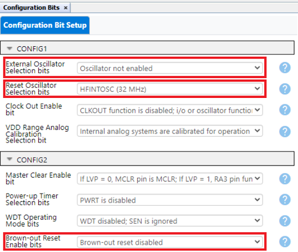

2.) Under **Project Resources** go to **Clock Control** and select _HFINTOSC_32MHz_ for **Current Oscillator Select** and set the **HF Internal Clock** to 1 MHz.

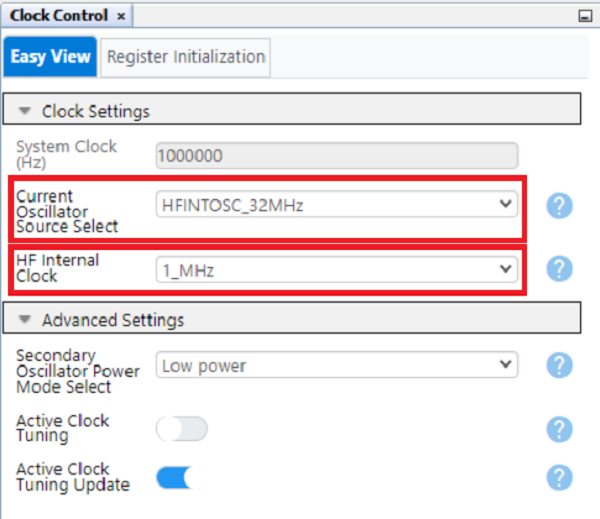

3.) When moving from the MCC configuration to the application code, most of the process for entering Sleep mode remains unchanged. Calling the command `SLEEP()` or `__asm(“sleep”)` will make the MCU enter it’s Low-Power state. In this state the CPU is no longer active. While in this state, any interrupt or reset that can be triggered in this state will wake up the device.

### Using Resets with Sleep Mode (Watchdog Timer)

After completing the initial setup, the first method covered will be waking up the MCU from Sleep mode using the Watchdog Timer (WDT). The WDT is traditionally used as a reset to protect from infinite loops, freezes, and timing issues. Additionally, the WDT can be run while the device is in Sleep; however if a time-out event occurs while the device is in Sleep mode, the MCU will leave its Sleep mode instead of executing a reset. This can be done by enabling the WDT before sending the Sleep command and simply waiting for it to time-out.

1.) To start, return to the **Configuration Bits** menu and set the **WDT Operating Mode bits** to _WDT enabled/disabled by SEN bit_ (the SEN bit is useful for disabling the WDT when not in use).

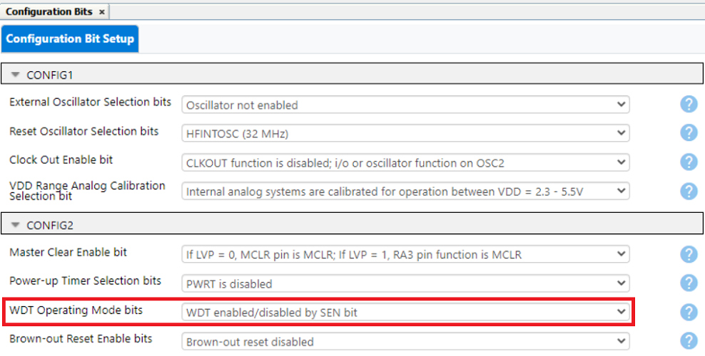

2.) After setting the WDT in the Configuration Bits tab, go to **Device Resources**, under **System** add the WDT module. Then set **Software Controlled Watchdog Timer Enable** to _ON_, set the **Watchdog Timer Clock Source Selection** to either the _LFINTOSC_ or _Secondary Oscillator (SOSC)_ and set the prescaler to an adequate value. 
Note: This example uses a value of 1:262144 for the _LFINTOSC_ to give a period of approximately 8.4 seconds, but a different timer period may be used.

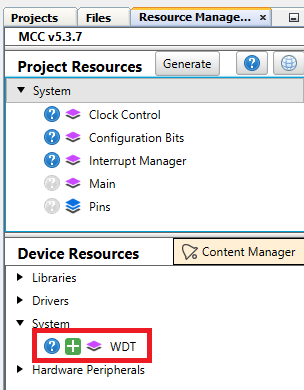
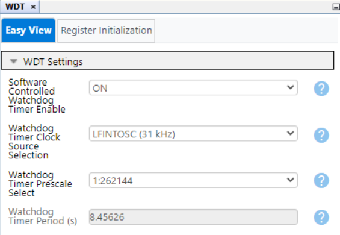 

3.) Once your code is generated, enable the WDT with the SEN bit before calling the Sleep command and disable it after leaving Sleep to prevent accidental resets. See the example below:

```
WDTCONbits.SEN = 1; //Enable Watchdog Timer while in sleep
SLEEP();
NOP();
WDTCONbits.SEN = 0; //Disable Watchdog to prevent full reset
```

Important: it is recommended to place a NOP command after a Sleep command. When the Sleep command is called, the next instruction is pipelined in the CPU. Having a NOP ensures no accidental operations are executed when switching in or out of low-power modes.

4.) To show when the MCU is active, the pin _RA1_ can be set to toggle the LED on the Curiosity Nano. Select _RA1_ under GPIO Output in the **Pin Grid View** menu, as shown below:

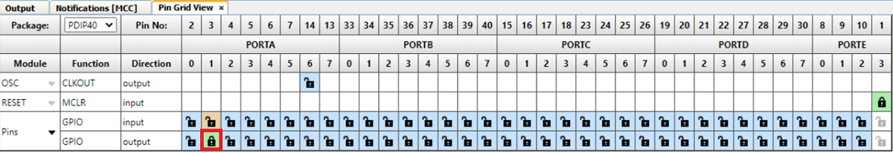

Then, for code readability, go **Device Resources** -> **Pins** and change the corresponding Pin name to "LED" as shown:

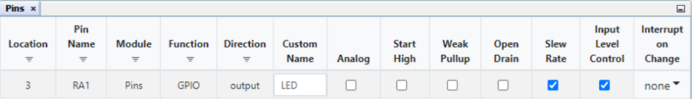

5.) Generate the new changes, then toggle the LED as shown below in the `main.c` while loop to make the Curiosity Nano LED blink while Awake. For demonstration purposes, a delay function was added to make the device stay awake for 250 ms before going back to Sleep.

```
LED_SetHigh(); //Turn Off LED
        
WDTCONbits.SEN = 1;
SLEEP();
NOP();
WDTCONbits.SEN = 0;
        
LED_SetLow(); 
__delay_ms(250);
```

6.) After entering the above code, program the Curiosity Nano and the LED will blink periodically as the device wakes.

### Using Interrupt-on-Change for Wake-Up

This example uses the PIC16F18076's Interrupt-on-Change (IOC) to trigger an interrupt that wakes the device from Sleep mode when the switch on the Curiosity Nano is pressed.

1.) Create a new project and repeat the initial setup mentioned earlier. Navigate to the **Pin Grid View** in MCC. Then select _RA0_ as a GPIO input for the SW0 push button and _RA1_ as a GPIO output for LED0, as shown below:

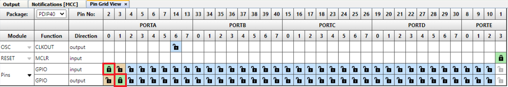

2.) Go to **Project Resources** -> **Pins** and give the pins _RA0_ and _RA1_ the custom names "SW0" and "LED" respectively. To keep the pin from floating when the button is not pressed, enable the _Weak Pullup_ on _RA1_. In the "Interupt On Change" column, select _negative_ for RA0/SW0 to trigger an interrupt to wake the controller on a negative edge. Settings are shown below:

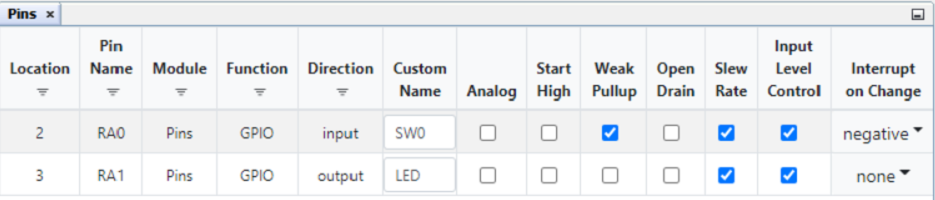

3.) Generate the code, then navigate to the `main.c` source file and add this code to the while loop:

```
while(1)
    {
        LED_SetHigh(); //Turn Off LED
        
        SLEEP();
        NOP(); //Prevent next instruction from loading while device enters sleep
        
        LED_SetLow(); //Turn on LED to show when Active
        while(!SW0_GetValue()){;} //block while button is held
    }
```

4.) Enable Global Interrupts by uncommenting `INTERRUPT_GlobalInterruptEnable();` from the same file then program the device. The LED will light-up when the SW0 is clicked and the device will be asleep when SW0 is not.

Note: A debounce circuit or function is good practice when using a push button. This demo leaves out hardware debouncing for simplicity. See an example of hardware debouncing that can be done using the Configurable Logic Cell (CLC) and Timer 2 peripherals in [this example](https://mplab-discover.microchip.com/com.microchip.mcu8.mplabx.project.pic18f16q40-clc-switch-debouncing).

### Using Peripheral Interrupts With Sleep Mode (ADCC)

The PIC16F18076’s Sleep mode can also be enabled using peripheral interrupts. These interrupts can come from a Timer, Configurable Logic Cell (CLC), ADCC, or other peripheral. This example will be using the threshold interrupt from the ADCC peripheral. The general process for using any peripheral interrupt as a wake-up will remain similar no matter what the peripheral setting is.

Before setting up the interrupt, configure the peripheral. For this example, the ADCC will be running in Basic Mode, Right-Aligned, and with the **Auto-conversion Trigger** set to _TMR2_. Set the **Positive Input Channel** to _AND0_ and the ADCC oscillator to ADCRC to enable ADCC operation while the PIC16F18076 is in Sleep. For the threshold: set the **Error Calculation Mode** to _Actual Result vs. Setpoint_, the **Threshold Setpoint** to “0”, **Threshold Interrupt Mode** to “ADERR > ADUTH”, and the **Upper Threshold** to a desired ADCC reading to trigger a wake-up.
Note: this example uses 700. Any value between 4095 and 0 will work for Basic Mode.
Last for this menu, switch on **ADTI Interrupt Enable**. 

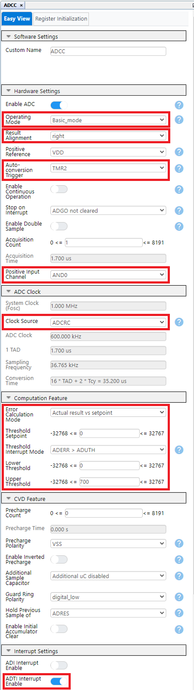


Next, add the TM2 module from **Device Resources** and change the oscillator from "HFINTOSC" to "LFINTOSC" and the timer period as desired. This example uses 1 ms, but any duration will work.

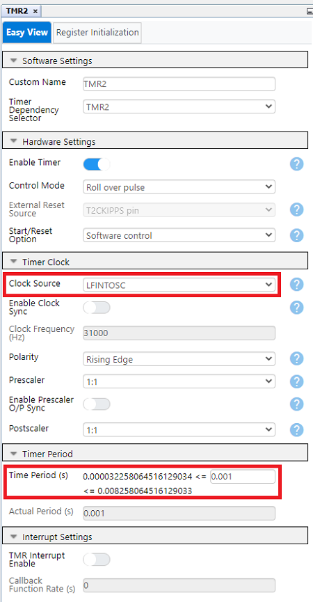


Next, navigate to the **Pin Grid View** at the bottom of the screen and set the ADCC ANx function to the desired analog pin, RD0 in this example. 

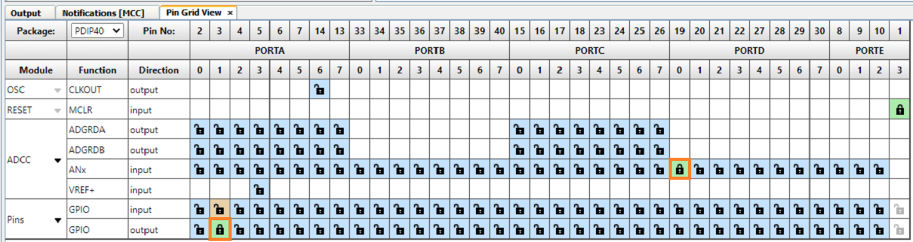


Then, go to **Project Resources** -> **Pins** and check that the ADCC input pin is set to _Analog_.

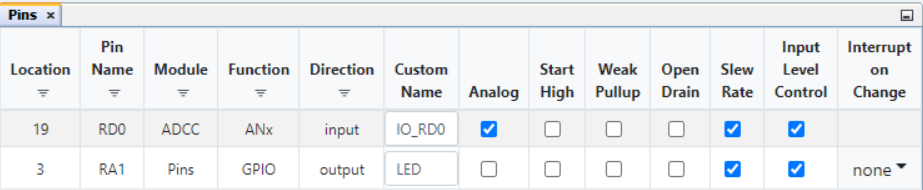


After configuring the peripheral and enabling interrupts for it generate the application code. Go into the `main.c`. Enable interrupts by uncommenting `INTERRUPT_GlobalInterruptEnable();` and `INTERRUPT_PeripheralInterruptEnable();`.

Note: Peripheral Interrupts for the PIC16F18076 may be used to wake the device from Sleep by only enabling peripheral interrupts, but are unable to execute tasks from the ISR as mentioned. (TODO: !!!Run Test on this to verify!!!)

Include the function call `TMR2_Start();` in the main function before the while loop to start the ADCC. Then add instructions for Sleep mode and to blink the LED. An optional while statement to keep the device awake while the ADCC result is above the threshold result was included below.

```
int main(void)
{
    SYSTEM_Initialize();
    INTERRUPT_GlobalInterruptEnable(); 
    INTERRUPT_PeripheralInterruptEnable(); 
    
    TMR2_Start();
    
    while(1)
    {
        LED_SetHigh(); //Turn Off LED
        
        SLEEP();
        NOP(); //Prevent next instruction from loading while device enters sleep
        
        LED_SetLow(); //Turn on LED to show when Active                
        
        while(ADCC_GetConversionResult() >= ((ADUTHH << 8) + ADUTHL)); // Block while ADCC is above designated value
    }    
}
```
After this, any suitable analog sensor may be connected to the ADCC input pin (RD0). Then the microcontroller can be programmed. This example uses a 1 kOhm potentiometer. When the sensor reading passes the defined point the device will wake up and the LED will light up, then go back to Sleep after the potentiometer leaves that range.

## Setting up a Test for Each Method

Since low-power is one of the most common reasons to use Sleep modes, an analysis of the power consumption for this demonstration has been made. A Power Debugger was connected to the Curiosity Nano. Then, the power strip was cut on the top of the board to disconnect the debugger. Solder a two-pin header on after the strap has been cut for connecting the debugger and to reconnect the debugger later. All unused pins need to be set to "High Impedance" and connected to ground or VSS. Lastly connect the Atmel Power Debugger to the microcontroller side of the new header and ground as shown below.


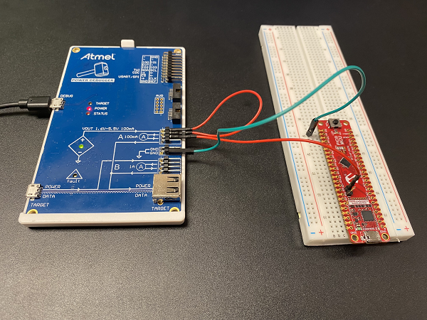

For the ADCC/Peripheral interrupt example, connect the potentiometer to the power supply, but before the ammeter, to isolate the MCU's power consumption from the potentiometer's.


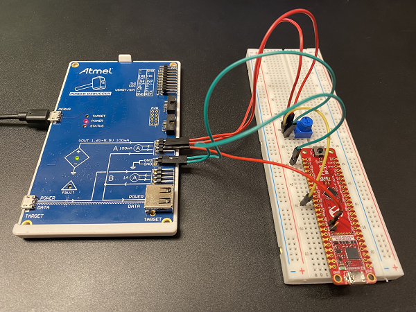


Note: For more details on how to use the power debugger see the Atmel Power Debugger User Guide on the [product page](https://www.microchip.com/en-us/development-tool/ATPOWERDEBUGGER?utm_source=GitHub&utm_medium=TextLink&utm_campaign=MCU8_MMTCha_pic16f18076&utm_content=intro-to-sleep-pic16f18076&utm_bu=MCU08). Alternatively a precision multimeter that can measure down to nA and a separate power supply may be used to measure current at this stage.

## Operation

Once connected, switch on Power and the power usage for any of the the above examples can be measured in Data Visualizer. Achieved values are shown below; however, exact values may vary from device to device. For average expected low-power currents, see the PIC16F18076 electrical specifications in the [data sheet](https://www.microchip.com/en-us/product/PIC16F18076?utm_source=GitHub&utm_medium=TextLink&utm_campaign=MCU8_MMTCha_pic16f18076&utm_content=intro-to-sleep-pic16f18076&utm_bu=MCU08).

### WDT Power Consumption

Shown below, the WDT example uses an average of 491 nA while asleep, and jumps to approximately 1.64 mA while active.

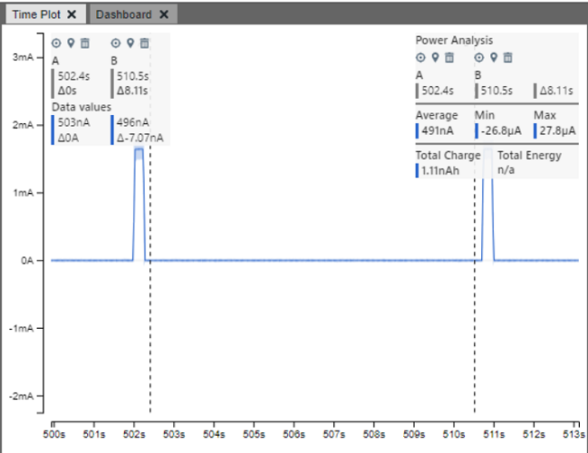
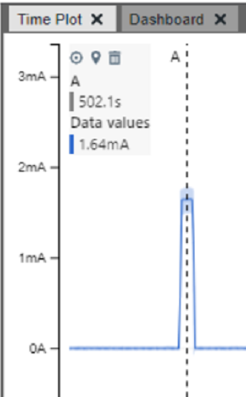

### Interrupt-on-Change Power Consumption

Shown below, the IOC example uses an average of 80nA while asleep, and jumps to approximately 1.77 mA while active. 

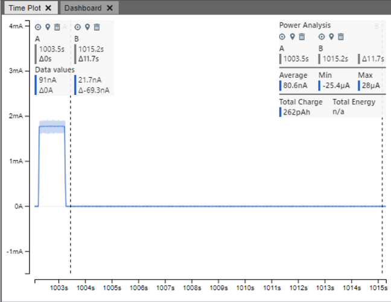
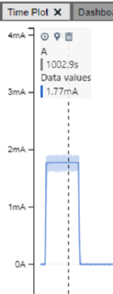

### ADCC/Peripheral Interrupt Power Consumption

The ADCC example differs from previous examples as there are three effective States for the demo:
- when the board is active
- when the board is asleep and waiting for TMR2
- when the board is asleep and the ADCC peripheral is running a conversion
The averages are shown with the described setting from earlier, however adjusting the duration between conversions will affect overall power usage for this demo. Shown above, the IOC example uses an average of 8.71 uA while asleep counting conversions, but an average of only 804 nA in between each conversion. The power consumption during an ADCC conversion jumped to roughly 82.4 uA. However this value does vary, and while active this example runs approximately 1.78 mA.

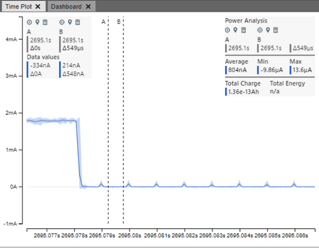
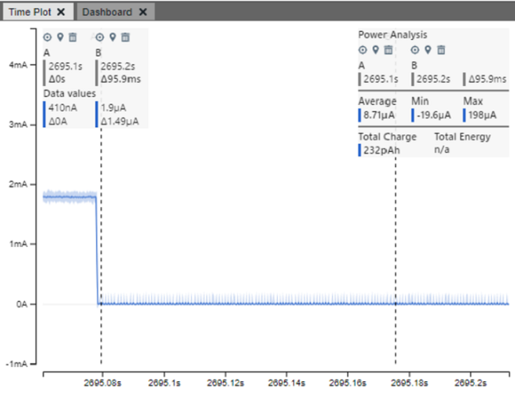
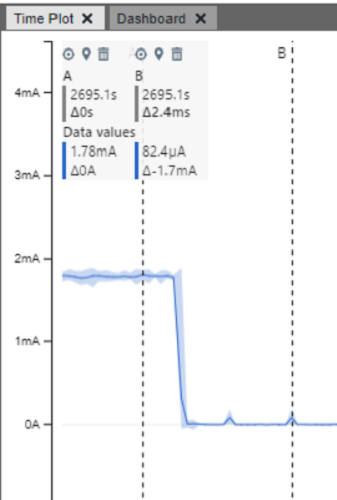

## Summary

These examples demonstrate how to set up and use the PIC16F18076 Sleep mode, along with methods of waking the device after using MCC.